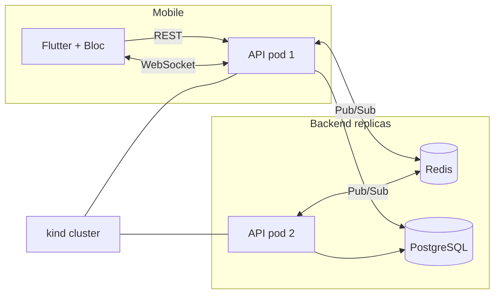

# Relaywave

A real-time messaging platform — chat rooms, presence, typing indicators —
built end to end as a professional-grade learning project. The goal is not a
novel product; it is to genuinely master **Flutter**, **FastAPI**, and the
**Docker + Kubernetes** toolchain the way a production system demands, by
tackling the one problem that separates a toy chat app from a distributed
system: **scaling stateful WebSocket connections across processes**.

[](https://github.com/ErickJoelQuispe/relaywave/actions/workflows/ci.yml)

## What this is

Relaywave is deliberately hard. The domain (real-time chat) forces real
networking problems — persistent connections, message fan-out, presence
state, reconciliation after drops — instead of CRUD-shaped ones.

The architectural centerpiece is **Redis Pub/Sub fan-out across pods**: once
the backend runs as multiple replicas behind a load balancer, in-memory
broadcast breaks, because two users on different pods share no memory space.
Redis becomes the cross-pod message bus, which is what makes Kubernetes
autoscaling (HPA) meaningful here rather than cosmetic.

## Tech stack

| Layer      | Choice                                                        |
| ---------- | ------------------------------------------------------------- |
| Backend    | FastAPI, async SQLAlchemy, Alembic, Pydantic                   |
| Realtime   | FastAPI native WebSockets + Redis Pub/Sub                      |
| Database   | PostgreSQL (source of truth for message history)               |
| Cache / bus| Redis                                                          |
| Mobile     | Flutter + Bloc, Drift (local cache), go_router, dio            |
| Auth       | JWT (access + refresh tokens), Argon2id password hashing       |
| Observability | Prometheus (`/metrics`), prometheus-fastapi-instrumentator |
| Local dev  | Docker Compose (API ×2, Postgres, Redis)                       |
| Production | Kubernetes on a local multi-node `kind` cluster + HPA          |
| CI/CD      | GitHub Actions (verify on PR; versioned image → GHCR on merge) |

## Features

- **Auth** — register, login, refresh-token rotation, logout, current-user
- **Rooms** — create, join, list, detail, slug-based sharing and lookup by name
- **Friends** — friend requests, accept/decline, block, and DM rooms split from groups
- **Real-time messaging** — send/receive over WebSockets, with typing and presence events
- **Best-effort delivery + reconciliation** — messages persist to Postgres *before*
  broadcast; clients backfill missed history on every (re)connect (`?after=<id>`)
- **Cross-replica fan-out** — Redis Pub/Sub delivers messages across API processes
- **Metrics** — active WebSocket connections and message throughput exposed at `/metrics`

## Architecture



The client maps socket traffic onto explicit Bloc events
(`MessageReceived`, `UserTyping`, `ConnectionLost`, `ConnectionRestored`) and
tracks the last message ID per room so a dropped socket never means a lost
message. Redis is a fast, disposable transport; Postgres is the durable
source of truth. See
[`docs/project-definition.md`](docs/project-definition.md) for the full
architecture, phase roadmap, and decision record (ADRs).

## Repository layout

```
backend/    FastAPI app, Alembic migrations, tests
mobile/     Flutter client (Bloc, Drift)
k8s/        Kubernetes manifests (deployment, service, HPA, jobs, secrets)
scripts/    deploy.sh — cluster rollout and rollback
docs/       project-definition.md (vision, phases, ADRs)
docker-compose.yml   multi-service local dev (2 API replicas + Postgres + Redis)
kind-config.yaml     local multi-node cluster definition
```

## Prerequisites

- **Python 3.12+** and [`uv`](https://docs.astral.sh/uv/)
- **Flutter** (stable channel) and Dart
- **Docker** and Docker Compose
- **kind** and **kubectl** (for the Kubernetes phase)

## Getting started

### 1. Backend

```bash
cd backend
uv sync
cp .env.example .env   # set JWT_SECRET_KEY (required, no default)
```

Start the supporting services and the API:

```bash
docker compose up -d postgres redis   # from the repo root
uv run uvicorn app.main:app --reload  # from backend/
```

The API is available at `http://127.0.0.1:8000`, with interactive docs at
`/docs`.

### 2. Mobile

```bash
cd mobile
flutter pub get
flutter run -d chrome   # or any device; dev CORS is scoped to localhost
```

The WebSocket endpoint requires the **first frame** to be an auth message
(browsers can't set a `Authorization` header on a WS handshake):

```json
{"type": "auth", "token": "<access-token>"}
```

### 3. Full stack with Docker Compose

From the repo root:

```bash
docker compose up --build
```

This boots **two independent API replicas** (`api` on `:8000`, `api-2` on
`:8001`) sharing the same Postgres and Redis — the empirical proof that
cross-replica message delivery works through the Pub/Sub bus, not shared
memory.

## Testing

```bash
# Backend
cd backend
uv run pytest              # unit + integration (WebSocket fan-out, auth, rooms)
uv run ruff check .        # lint

# Mobile
cd mobile
flutter test
flutter analyze
```

The backend integration suite runs against a dedicated `relaywave_test`
database. Create it once:

```bash
docker compose exec postgres createdb -U relaywave relaywave_test
```

## Kubernetes deployment

The production target is a local multi-node `kind` cluster with `metrics-server`
(required for HPA). Manifests live under `k8s/`.

```bash
kind create cluster --config kind-config.yaml
kubectl apply -f k8s/namespace.yaml
kubectl apply -f k8s/postgres/ -f k8s/redis/ -f k8s/backend/
```

Deploy a specific image version (published to GHCR by CI, tagged by short
commit SHA — never `latest`):

```bash
scripts/deploy.sh <git-sha>
scripts/deploy.sh rollback   # undo the most recent rollout
```

See [`scripts/deploy.sh`](scripts/deploy.sh) for prerequisites.

## CI/CD

GitHub Actions runs a verification pipeline on every PR — backend lint and
tests (with real Postgres + Redis service containers), `flutter analyze` and
`flutter test`, and a Docker image build. On merge to `master`/`main`, a
versioned backend image is published to GHCR. Cluster rollout remains a
deliberate, manual, locally-run step (a hosted runner has no network path to
a local `kind` cluster).

## Roadmap

1. **Phase 0 — Foundations** ✅
2. **Phase 1 — Core chat, single instance** ✅
3. **Phase 2 — Distributed messaging** (Redis Pub/Sub fan-out) ✅
4. **Phase 3 — Kubernetes** (deploy, HPA, pod-eviction behaviour)
5. **Phase 4 — Polish & professional workflow** (CD to GHCR, structured tests)
6. **Phase 5 — Stretch** (Prometheus/Grafana dashboards, WebRTC voice)

Full context, open questions, and every architectural decision (ADR-001 →
ADR-004) live in [`docs/project-definition.md`](docs/project-definition.md).

## Contributing

Commits follow [Conventional Commits](https://www.conventionalcommits.org/).
Scope by component (`backend`, `mobile`, `k8s`, `ci`). Tests ship with the
code they cover, as reviewable work units.
